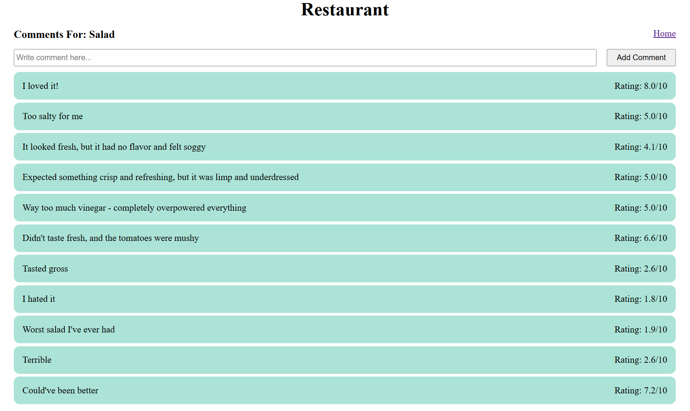
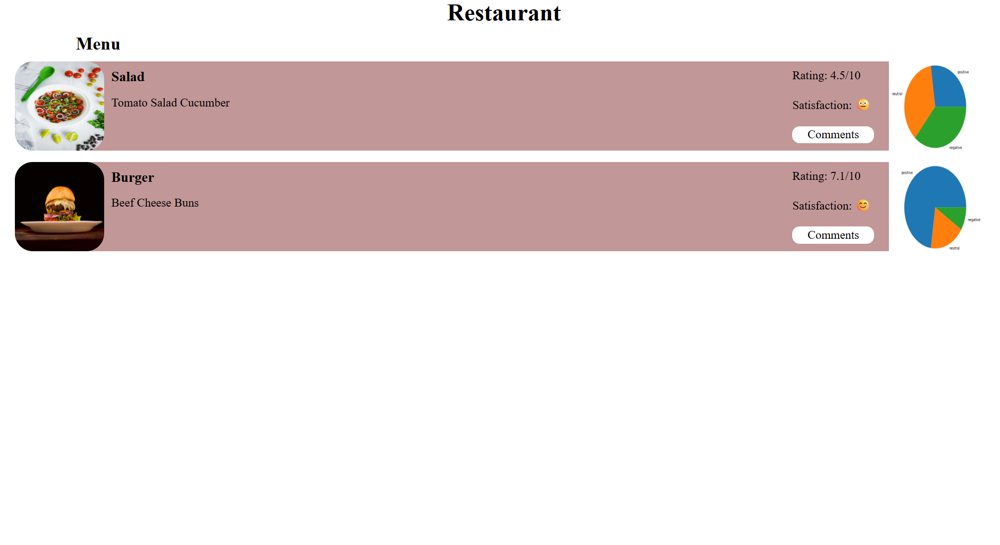

# Sentiment Analyzer

Web-based sentiment analysis tool made with Flask and NLTK library to analyze customer feedback on restaurant menu items. User comments are automatically given rating from 0 to 10 and categorized as positive, neutral, or negative, and results are visualized with Matplotlib pie charts.

---

